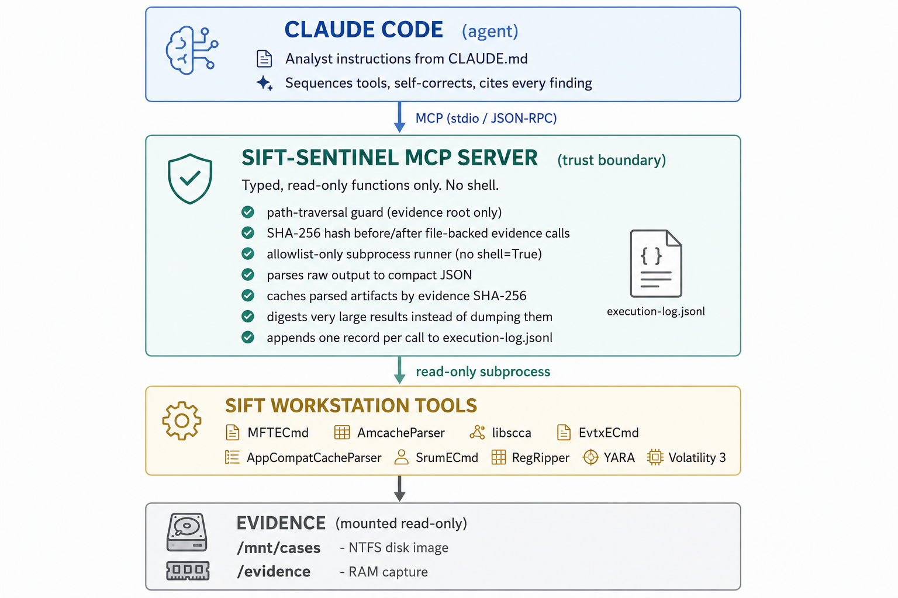
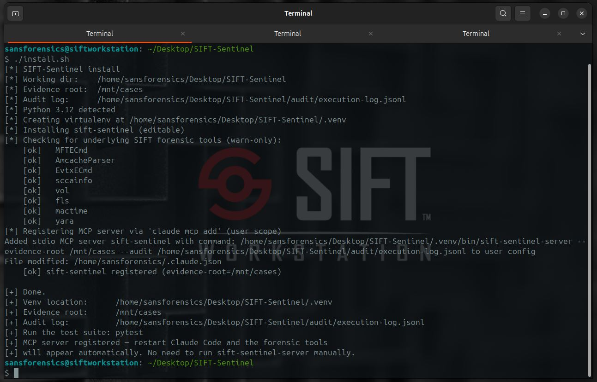

# SIFT-Sentinel

An autonomous, evidence-safe incident-response analyst for the SANS SIFT
Workstation. Built for the Find Evil! hackathon.

The goal is to make Protocol SIFT useful as a fully autonomous triage agent
without two of its current problems: hallucinated findings, and the risk of an
agent modifying original evidence. SIFT-Sentinel does this by exposing the SIFT
toolset to Claude Code through a custom MCP server that only offers typed,
read-only functions, and by parsing raw tool output into compact JSON before the
model ever sees it.

Architecture: Custom MCP Server (the trust boundary) plus Claude Code as the
reasoning agent. Eighteen read-only forensic tools, structured parsers, artifact
caching, and a test suite that runs with no real SIFT tools and no API key.

## Demo

A screencast of a live triage run — terminal execution with narration, including
a self-correction sequence.

[](https://youtu.be/G-Joj5jwE7Y)

YouTube Link: https://youtu.be/G-Joj5jwE7Y
Raw video file in this repo: [`docs/demo_video.mp4`](docs/demo_video.mp4)

## Inspiration

An AI-driven adversary can go from initial access to domain control in under
eight minutes. The defender is usually still pulling up their toolkit. Protocol
SIFT showed that connecting an agent to the SIFT Workstation over MCP is viable,
but it hallucinates more than is acceptable for evidence work. We wanted to see
how much of that could be fixed structurally rather than with prompt tuning, and
whether evidence integrity could be made an architectural guarantee instead of a
rule the model is asked to follow.

## What it does

Point it at a mounted Windows disk image and a RAM capture and ask it to triage.
Claude Code, following the analyst instructions in `CLAUDE.md`, drives a fixed
set of read-only tools to:

- Work broad to narrow: execution evidence and the filesystem timeline first,
  then pivot into memory, logons, and persistence.
- Corroborate across sources. A finding is only marked CONFIRMED when at least
  two independent artifacts agree (for example Prefetch, Amcache, and MFT).
- Surface contradictions. When disk and memory disagree, it reports a
  CONTRADICTION rather than quietly choosing one.
- Self-correct. If a gap remains it re-runs more narrowly, for example with a
  tighter `path_filter` or a specific event ID.
- Cite its work. Every claim references the `call_id` of the tool execution that
  produced it, which is recorded in an append-only audit log.

There is no `execute_shell` tool. The agent cannot run a destructive command
because no such function exists in its action space.

## Features

Evidence safety:

- Typed, read-only MCP action space. No `execute_shell`, no generic command
  function. Destructive actions are not expressible.
- Allowlist-only subprocess runner. Arguments are passed as a list, never as a
  shell string, and `shell=True` is never used. Any binary not on the explicit
  allowlist is refused.
- Path-traversal guard. Every tool-supplied path is resolved and checked to be
  inside an allowed evidence root before use. Multiple roots are supported (for
  example a disk root plus a separately mounted RAM capture) without widening to
  the whole filesystem.
- SHA-256 of each file-backed evidence artifact is recorded before and after
  tool calls. A changed post-call hash is returned as an integrity error and
  logged in the audit record.

Accuracy and output handling:

- Raw tool output is parsed into compact, typed JSON records before it reaches
  the model. The model never sees a multi-megabyte CSV.
- Parsed-artifact caching is keyed by evidence SHA-256. Expensive MFT, EVTX,
  Amcache, ShimCache, and SRUM parses are reused safely when the same evidence
  is queried again with a different filter.
- A byte budget caps the serialized record payload of every response
  (`SIFT_MAX_BYTES`, default 60 KB) in addition to a record-count cap
  (`SIFT_MAX_RECORDS`), so no single call can overrun the transport.
- MFT digest mode condenses a full timeline (which can be 200k+ records) into a
  total count, a deleted count, a created-by-month histogram, and a curated set
  of records worth attention: executables and scripts in user-writable paths,
  masquerading double extensions, NTFS alternate data streams, and deleted
  executables.
- Narrowing parameters (`path_filter`, `event_id`) let the agent re-run focused
  queries during self-correction instead of re-dumping everything.
- Event-log parsing extracts actor fields from EVTX payloads: target account,
  subject account, source IP, workstation, logon type, service name, image path,
  and PowerShell script-block text.
- The CSV parser tolerates ragged rows from the underlying tools rather than
  crashing on them.

Reasoning discipline:

- Confidence model with four explicit levels: CONFIRMED, INFERRED, UNCERTAIN,
  CONTRADICTION. CONFIRMED requires at least two supporting `call_id`s, enforced
  by the data model.
- Multi-source correlation across disk and memory (for example a netscan C2
  connection tied to a PID whose binary the MFT shows was dropped seconds
  earlier).
- A super-timeline merges MFT, Amcache, ShimCache, EVTX, and Prefetch records
  into one time-ordered view for incident-window correlation.
- Senior-analyst instructions in `CLAUDE.md` and a `/triage` workflow that set
  the sequencing, corroboration, and citation rules.

Auditability and output:

- Append-only JSONL audit log, one record per tool call, with timestamp,
  arguments, input hash, binary executed, duration, an output summary, and a
  per-call token count. Any finding traces back to a `call_id`.
- The `tokens` field is the estimated size, in tokens, of the response payload
  that call returned into the agent's context. A read-only MCP server never sees
  the model's own prompt/completion usage, so rather than invent that number we
  record the one token cost we can measure honestly at the trust boundary —
  estimated deterministically and offline (`sift_sentinel/tokens.py`), over the
  exact payload the agent receives (after the byte budget and MFT digest). It is
  the per-call cost an operator uses to reason about context budget.
- Report generation checks for missing or duplicate `call_id` references so
  citations remain unambiguous.
- Offline report generation (`sift-sentinel-report`) renders a findings document
  from the narrative plus the audit log, after the investigation.
- A benchmark harness (`benchmark/score.py`) scores findings against ground
  truth and against the Protocol SIFT baseline.

Operations:

- Runs on a stock SIFT Workstation. Prefetch uses `sccainfo` (libscca) and the
  registry uses `rip.pl` (RegRipper), so no Windows runtime is needed.
- Adds Linux-friendly wrappers around common Zimmerman and Volatility outputs:
  AppCompatCacheParser, SrumECmd, EvtxECmd, AmcacheParser, MFTECmd, YARA, and
  Volatility 3.
- Graceful degradation. For example, an empty Prefetch directory on a domain
  controller, or a missing YARA rules file, returns a clear message rather than
  an error dump.
- Independent broad-sweep calls can run concurrently through a thread-pool
  helper while preserving append-only audit records.
- One-step `install.sh` that sets up a virtualenv, installs dependencies and
  `yara`, and registers the MCP server with Claude Code.
- Tests run with no real SIFT tools and no API key, using captured fixtures and
  an injected fake runner.

## 18 Tools exposed to Claude Code

The table below is the overview; per-tool signatures, parameters, return shape,
and the guarantees shared by every call are in
[`docs/tools.md`](docs/tools.md).

| Tool | Underlying binary | Forensic question |
|---|---|---|
| `extract_mft_timeline` | MFTECmd | When were files created or modified? |
| `get_amcache` | AmcacheParser | What programs executed or were present? Optionally suppress known-good hashes. |
| `analyze_prefetch` | libscca (`sccainfo`) | Execution count and last-run times |
| `shimcache` | AppCompatCacheParser | Binary presence/execution evidence when Prefetch is absent |
| `srum` | SrumECmd | Per-app resource usage, network bytes, and exfiltration signals |
| `parse_event_logs` | EvtxECmd | Security, service-install, and PowerShell events with actor fields extracted |
| `logon_summary` | EvtxECmd | 4624/4625 logons grouped by account, source IP, and logon type |
| `powershell_logs` | EvtxECmd | PowerShell 4103/4104 command and script-block activity |
| `registry_autoruns` | RegRipper (`rip.pl`) | Persistence and autostart entries |
| `yara_scan` | YARA | Known-bad signature matches over evidence |
| `read_artifact` | Internal read-only reader | Text artifacts such as PowerShell transcripts, hashed and audited |
| `mem_pslist` | Volatility 3 | Processes running at RAM-capture time |
| `mem_pstree` | Volatility 3 | Parent/child process relationships |
| `mem_cmdline` | Volatility 3 | Per-process command lines |
| `mem_netscan` | Volatility 3 | Network connections / C2 signal |
| `mem_malfind` | Volatility 3 | Injected or unbacked executable memory regions |
| `mem_svcscan` | Volatility 3 | Services resident in memory and their binaries |
| `super_timeline` | Internal correlation | Time-ordered view across disk, execution, and event artifacts |

Adding a tool is a small change to the trust boundary: implement the wrapper,
register the typed MCP function in `mcp_server.py`, add it to
`tools/registry.py` for non-MCP callers/tests, and add an allowlist entry in
`runner.ALLOWED_BINARIES` if it spawns an external binary. Internal tools such as
`read_artifact` and `super_timeline` still pass through path, hash, and audit
controls even though they do not spawn an external binary.

## Architecture



A full written walkthrough — components, data flow of a single tool call, the
trust boundary, and the two guardrail layers — is in
[`docs/architecture.md`](docs/architecture.md).

There are two separate guardrail layers, and we keep them distinct:

- Architectural: the MCP action space, read-only mounts, hash verification, and
  the allowlist runner. The agent cannot get around these because they are a
  property of what code exists.
- Prompt-based: the analyst discipline in `CLAUDE.md` (confidence tagging,
  sequencing). This improves quality but is never relied on for evidence
  integrity.

## Architecture decisions and why

Custom MCP Server rather than a Direct Agent Extension or an alternative IDE.
The hackathon allows four approaches. We chose the MCP server because it is the
only one where evidence integrity is enforced by architecture rather than by the
model following instructions. With a shell-exposed agent, "do not modify
evidence" is a request the model can ignore. Here the destructive action is not
present in the action space, so there is nothing to ignore.

Typed functions instead of a generic command tool. Exposing
`extract_mft_timeline(...)` rather than `run("mftecmd ...")` means the server,
not the model, decides which binaries run and with which arguments. It also lets
the server own output handling, which is where the accuracy work happens.

A single allowlist-only runner with no shell. Every external execution funnels
through one function that takes an argument list, refuses any binary not on the
allowlist, and never invokes a shell. This makes the destructive-command and
command-injection surface a single, small, auditable chokepoint instead of being
spread across each tool.

Parse before the model sees anything. A full `$MFT` is roughly 236k records and
about 60 MB of CSV. Feeding that to a model wastes context and is a known source
of hallucination from truncated or garbled text. Parsing to small typed records
first keeps context clean and makes the model's job a reasoning task, not a
text-extraction task.

A byte budget and a digest, not just a row cap. We initially capped responses by
record count. That still overran the transport, because record width, not count,
is what matters: 1,000 wide MFT rows are about 257 KB, and they are mostly
filesystem metadata of no interest. The byte budget guarantees the payload fits
regardless of width, and the digest returns the records that actually matter so
the agent reasons over signal rather than volume.

Confidence as a data model, not a convention. Asking a model to label its
confidence is unreliable. Instead, CONFIRMED requires at least two supporting
`call_id`s in the data structure, so an unsupported confident claim cannot be
represented. This is the direct structural answer to the hallucination problem.

Append-only audit log with call-id citation. Every tool call writes one
immutable record, and every finding cites the `call_id` that produced it. This
gives traceability for free and is also the execution-log deliverable. We chose
JSON Lines because it is append-only by nature and never needs rewriting.

Report generation kept out of band. A findings report has to be written
somewhere, which is a write operation. Rather than weaken the read-only action
space, report generation is a separate offline command that runs after the
investigation over data that already exists (the narrative and the audit log).

Claude Code as the agent, with no separate runner or API key. The tools are
invoked directly by Claude Code over MCP, so there is no extra service to run and
no key to manage. A judge can install, mount evidence, and triage without
standing up additional infrastructure.

Linux-native underlying tools. Using `sccainfo` for Prefetch and `rip.pl` for
the registry means the entire pipeline runs on a stock SIFT Workstation without a
Windows runtime, which keeps the try-it-out path simple.

Read-only mounts plus hashing for spoliation proof. Images are mounted
`ro,noexec,nodev` and every evidence file is hashed before and after a run.
Identical hashes across file-backed tool calls and whole-investigation
`EvidenceSet` checks are the evidence that nothing was modified, which is what
the accuracy report needs to demonstrate.

## Handling very large outputs

The most useful reliability fix came from running the agent against the real
domain-controller image and watching it fail. `extract_mft_timeline` returned
236,778 records and the response was spilled to a temp file because it exceeded
the transport limit even after the old row cap. We fixed it with the byte budget
and the MFT digest described above, so a full unfiltered timeline now returns a
usable summary plus the curated set of interesting records, and the agent uses
`path_filter` to enumerate a specific directory in full when needed.

## Challenges

- A row cap looked safe and still overran the transport, because record width,
  not record count, is what matters. We only caught it by running against real
  evidence.
- We use `sccainfo` (libscca) for Prefetch and `rip.pl` for the registry so the
  whole pipeline runs on a stock SIFT Workstation with no Windows runtime.
- Keeping the read-only boundary intact meant rejecting a few convenient
  shortcuts, such as letting the agent write its own report.

## What we learned

The largest accuracy improvements were architectural. Structured parsing and
digesting large results removed whole categories of hallucination before any
prompt work, and made the claim that the destructive tool simply does not exist
one we can actually stand behind.

## Dataset

Full evidence dataset documentation — source, artifacts read, and findings — is
in [`docs/dataset.md`](docs/dataset.md).

SIFT-Sentinel was developed and tested against the **SANS Find Evil!
"SRL-2018 Compromised Enterprise Network"** dataset (provided by SANS for the
hackathon). It has been run end-to-end against **two host images from this
dataset** — each a self-contained run with its own audit log, triage report, and
demo:

| Run | Host | Disk + memory | Triage report | Audit log |
|---|---|---|---|---|
| **`base-dc`** | `base-dc.shieldbase.lan` — Windows Server 2016 **domain controller** | `base-dc-cdrive.E01` + `base-dc-memory.7z` → `/mnt/cases`, `/evidence/base-dc-memory.img` | [`triage-report-base-dc-2026-06-14.md`](audit/triage-report-base-dc-2026-06-14.md) | [`execution-log-base-dc.jsonl`](audit/execution-log-base-dc.jsonl) |
| **`base-file`** | `base-file.shieldbase.lan` — Windows Server **file server** | `base-file-cdrive.E01` + `base-file-memory.7z` → `/mnt/file-case`, `/evidence/base-file-memory.img` | [`triage-report-base-file.md`](audit/triage-report-base-file.md) | [`execution-log-base-file.jsonl`](audit/execution-log-base-file.jsonl) |

Both hosts belong to the same `shieldbase.lan` domain, so the runs corroborate
each other (the same `BASE-HUNT` source and the same F-Response / `Mnemosyne.sys`
IR tooling appear in both).

**What the agent found — `base-dc`** (full report:
[`audit/triage-report-base-dc-2026-06-14.md`](audit/triage-report-base-dc-2026-06-14.md)):

- **CONFIRMED** — F-Response remote-forensics agent (`subject_srv.exe`) and the
  `mnemosyne` kernel driver (`Mnemosyne.sys`) staged in `C:\Windows` on
  2018-09-06/07, each corroborated by MFT plus a 7045 service-install event, and
  attributed to IR/acquisition tooling rather than an adversary.
- **INFERRED** — a sustained series of 163 failed logons (event 4625) from
  `BASE-HUNT$` at `172.16.5.25` against the DC over ~27 hours.
- **CONTRADICTION** — memory tooling returned zero processes with no error,
  flagged as a silent tooling failure (a blind spot), not evidence of a clean
  host.

**What the agent found — `base-file`** (full report:
[`audit/triage-report-base-file.md`](audit/triage-report-base-file.md); demo:
[`docs/sans-2018-base-file-demo.mp4`](docs/sans-2018-base-file-demo.mp4)):

- **CONFIRMED** — fake "Microsoft Advanced API 32/64" services backed by
  `msadvapi2_*.exe` (staged via `install_wormhole`) and a WinPcap `npf.sys`
  driver, corroborated by MFT plus 7045 service-install events, with rogue CA
  certs dropped alongside; the same F-Response / `Mnemosyne.sys` IR tooling seen
  on `base-dc`.
- **INFERRED** — an `rsydow-a` 2-minute beacon loop (160+ Type 3 logons from
  `172.16.4.4`) plus off-subnet `cbarton` logons from `10.10.x.x`.
- **CONTRADICTION** — memory tooling again returned zero records on a valid,
  hashed image (same Volatility profile mismatch), flagged as a blind spot.

## Try it out

Full step-by-step installation, mounting, and troubleshooting is in
[`docs/installation.md`](docs/installation.md).

Requires the SANS SIFT Workstation (Ubuntu-based, IR tools pre-installed).

### 1. Install
```bash
git clone https://github.com/PushpenderIndia/SIFT-Sentinel
cd SIFT-Sentinel
./install.sh
```
`install.sh` creates a virtualenv (on local disk if it detects a vboxsf shared
folder), installs the package and dev dependencies, installs `yara` via apt if
missing, and registers the `sift-sentinel` MCP server in
Claude Code's MCP configuration. Pass a custom root with
`./install.sh --evidence-root /mnt/cases`.



### 2. Mount evidence read-only before restarting Claude Code
```bash
# Disk image (E01 -> raw -> NTFS mount, read-only)
sudo mkdir -p /mnt/ewf /mnt/cases
sudo ewfmount /path/to/base-dc-cdrive.E01 /mnt/ewf
sudo mount -t ntfs-3g -o ro,noexec,nodev /mnt/ewf/ewf1 /mnt/cases

# Memory capture
sudo mkdir -p /evidence
sudo 7z x /path/to/base-dc-memory.7z -o/evidence/
```
Artifacts then live at `/mnt/cases/$MFT`,
`/mnt/cases/Windows/appcompat/Programs/Amcache.hve`,
`/mnt/cases/Windows/Prefetch/`,
`/mnt/cases/Windows/System32/config/SYSTEM`,
`/mnt/cases/Windows/System32/config/SOFTWARE`,
`/mnt/cases/Windows/System32/sru/SRUDB.dat`,
`/mnt/cases/Windows/System32/winevt/Logs/`, and `/evidence/<memory>.img`.

### 3. Triage
Restart Claude Code so the MCP server starts and the tools appear, then run
`/triage` or ask directly:
```
Triage the domain controller evidence at /mnt/cases with memory at
/evidence/base-dc-memory.img. Start with execution evidence and the MFT
timeline, then check memory, logons, and persistence. Cross-reference across
sources and flag anything CONFIRMED. Cite the call_id for every finding.
```

### 4. Test
```bash
source .venv/bin/activate
pytest            # no forensic tools or API key required
```

## Three-claim trace (for judges)

The Official Rules guarantee that any finding in the agent's report traces back
to the specific tool execution that produced it. Below are three representative
claims from the primary scored run (DFIR Madness Case 001), each resolved to its
audit log entry in
[`audit/execution-log-szechuan.jsonl`](audit/execution-log-szechuan.jsonl).

| Claim (from triage report) | call\_id | Tool | Log entry key fields |
|---|---|---|---|
| "`coreupdater.exe` (PID 3644) confirmed running at memory-capture time" | `call-000005` | `mem_pslist` | `"binary":"vol"`, `"tool":"mem_pslist"`, output\_summary lists `coreupdater.exe` |
| "C2 `ESTABLISHED` TCP to `203.78.103.109:443` from PID 3644" | `call-000006` | `mem_netscan` | `"binary":"vol"`, `"tool":"mem_netscan"`, output\_summary first bullet: `203.78.103.109:443` |
| "312 failed + 1 successful logon, `Administrator@194.61.24.102`, type=10 (RemoteInteractive)" | `call-000012` | `logon_summary` | `"binary":"cache:evtx"`, `"tool":"logon_summary"`, output\_summary first bullet: `Administrator@194.61.24.102 type=10 ok=1 fail=312` |

To verify: `grep "call-000005\|call-000006\|call-000012" audit/execution-log-szechuan.jsonl | python3 -m json.tool`

The full chain-of-custody check (all cited `call_id`s vs. logged records) can
also be run offline:
```bash
python -m sift_sentinel.report \
  --audit audit/execution-log-szechuan.jsonl \
  -f audit/triage-report-citadel-dc01-2026-06-15.md \
  --case "DFIR Madness Case 001" \
  -o /tmp/szechuan-report.pdf
# Output: "PASS: all N cited call_id(s) resolve to a logged tool invocation"
```

## Required deliverables

| # | Deliverable | Where |
|---|---|---|
| 1 | Code repository (public, MIT) | this repo |
| 2 | Demo video including a self-correction sequence | [YouTube](https://youtu.be/G-Joj5jwE7Y) · raw file [`docs/demo_video.mp4`](docs/demo_video.mp4) (also on the Devpost submission). Additional demo recording — `base-file` SANS run: [`docs/sans-2018-base-file-demo.mp4`](docs/sans-2018-base-file-demo.mp4) |
| 3 | Architecture diagram and trust boundaries | this README, Architecture section |
| 4 | Written project description | this README |
| 5 | Dataset documentation | Run against **two SANS Find Evil! "SRL-2018" hosts** — `base-dc` (`base-dc-cdrive.E01` + `base-dc-memory.7z`) and `base-file` (`base-file-cdrive.E01` + `base-file-memory.7z`) — **plus DFIR Madness Case 001 "Stolen Szechuan Sauce"** (`CITADEL-DC01` + `DESKTOP-SDN1RPT`); see [`docs/dataset.md`](docs/dataset.md) |
| 6 | Accuracy report including spoliation | `src/sift_sentinel/benchmark/score.py` + hash-invariance check; primary scored run (DFIR Madness Case 001 Szechuan Sauce) in [`docs/accuracy_report_szechuan.md`](docs/accuracy_report_szechuan.md) (F1=0.818, 0% hallucination rate); SANS SRL-2018 base-dc run in [`docs/accuracy_report.md`](docs/accuracy_report.md) |
| 7 | Try-it-out instructions | this README and `install.sh` |
| 8 | Agent execution logs | one record per call — `audit/execution-log-base-dc.jsonl`, `audit/execution-log-base-file.jsonl` (SANS SRL-2018) and `audit/execution-log-szechuan.jsonl` (Szechuan Sauce) |

## License

MIT, see [`LICENSE`](LICENSE).
